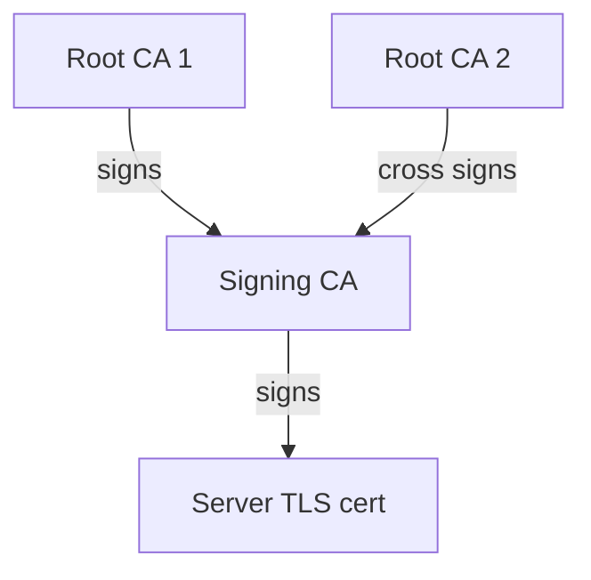

# PKI in Practice Lab: Simple PKI with openssl

## Introduction

Now that we have built a more intuitive understanding of the role played by asymmetric public and private keys in securing communications across insecure channels, we will look at how it can be established that a key pair is legitimately owned by an entity. To this end, this lab sets up a simple Public Key Infrastructure (PKI) using openssl, based on the approach taken in <https://pki-tutorial.readthedocs.io/en/latest/>.

A PKI is a set of processes and infrastructure required to create, distribute, store and revoke digital certificates. These certificates are then used to prove the ownership of a public key, through a chain of digital signatures (representing a chain of trust), which is underpinned by a Root Certification Authority (CA).

The following shows the format of an example 'X.509 certificate', which could be used for instance by a web server to prove ownership of the public part of an asymmetric key pair used in TLS connections to the server:

```txt
Certificate:
    Data:
        Version: 3 (0x2)
        Serial Number: 1 (0x1)
        Signature Algorithm: sha256WithRSAEncryption
        Issuer: DC=example, DC=control-plane, O=ControlPlane, OU=ControlPlane Signing CA, CN=ControlPlane Signing CA
        Validity
            Not Before: Aug 15 14:26:23 2023 GMT
            Not After : Aug 14 14:26:23 2025 GMT
        Subject: DC=example, DC=control-plane, O=ControlPlane, OU=ControlPlane, CN=control-plane.example
        Subject Public Key Info:
            Public Key Algorithm: rsaEncryption
                Public-Key: (4096 bit)
                Modulus:
                    00:bc:66:c0:94:60:4f:cf:f7:79:01:eb:d1:df:3f:
                    .............................................
                    e6:44:cd
                Exponent: 65537 (0x10001)
        X509v3 extensions:
            X509v3 Key Usage: critical
                Digital Signature, Key Encipherment
            X509v3 Basic Constraints: 
                CA:FALSE
            X509v3 Extended Key Usage: 
                TLS Web Server Authentication, TLS Web Client Authentication
            X509v3 Subject Key Identifier: 
                B1:F0:C9:DE:38:86:49:BE:56:FA:07:DF:67:1D:81:65:FB:BB:62:97
            X509v3 Authority Key Identifier: 
                F0:60:24:7C:3A:47:20:33:B3:66:C7:64:D5:FE:E3:D0:C9:6D:43:13
            X509v3 Subject Alternative Name: 
                DNS:control-plane.example
    Signature Algorithm: sha256WithRSAEncryption
    Signature Value:
        48:4b:3e:07:ee:3a:69:50:15:59:37:e2:01:b3:14:93:91:ee:
        ......................................................
        a0:30:82:aa:d2:ea:eb:48
-----BEGIN CERTIFICATE-----
MIIGNjCCBB6gAwIBAgIBATANBgkqhkiG9w0BAQsFADCBkzEXMBUGCgmSJomT8ixk
................................................................
1P2gMIKq0urrSA==
-----END CERTIFICATE-----
```

Note the following parts of the above certificate file:

- `Issuer` - the identity of the CA which signed the certificate
- `Subject` - the identity of the entity claiming ownership of the public key
- `Subject Public Key Info` - the public key itself
- `Signature Value` - the signature from the issuer which binds the public key to the subject
- The certificate in PEM format (Base64 ASCII encoding) between `-----BEGIN CERTIFICATE-----` and `-----END CERTIFICATE-----`. Note that this has been redacted to save space, along with the public key and signature.

In this lab, we will look at an example PKI where a Root CA (which has a self-signed certificate) signs a certificate for a 'Signing CA', which in turn signs a TLS certificate for a server (like the one shown above). We will then look at the implications of 'cross signing', whereby multiple valid paths exist between a root certificate and a node certificate. The following diagram shows our example setup:



## Running the Lab

### TLS Connection to a Server

Ensure you are in the [simple-pki](../lab-2-simple-pki/) directory for this lab. Once there, set up sub-directories for certificates, crls and CA databases, and then create the initial files to hold the DBs for the Root CA:

```bash
mkdir -p ca/root-ca-1/private ca/root-ca-1/db crl certs
chmod 700 ca/root-ca-1/private
touch ca/root-ca-1/db/root-ca-1.db
touch ca/root-ca-1/db/root-ca-1.db.attr
echo 01 > ca/root-ca-1/db/root-ca-1.crt.srl
echo 01 > ca/root-ca-1/db/root-ca-1.crl.srl
```

Create a private key and a Certificate Signing Request (CSR) for the Root CA. Note that we are not requiring a passphrase to protect the private key - this is unsafe outside of a demo environment! Usually, elaborate key signing ceremonies would be required to set up a Root CA, as the compromise of the private key would mean that an attacker could masquerade as an entity which relies on the PKI to prove its identity.

```bash
openssl req -new \
    -config config/root-ca.conf \
    -out ca/root-ca-1.csr \
    -keyout ca/root-ca-1/private/root-ca-1.key
```

Create a self-signed certificate for the root CA, and reply to prompts with 'y':

```bash
openssl ca -selfsign \
    -config config/root-ca.conf \
    -in ca/root-ca-1.csr \
    -out ca/root-ca-1.crt \
    -extensions root_ca_ext
```

Take the same steps for the signing CA, noting this time that we are submitting the CSR to the Root CA rather than creating a self-signed certificate.

Set up directories for certificates, crls and CA databases, and create initial files to hold the Signing CA's DBs:

```bash
mkdir -p ca/signing-ca-1/private ca/signing-ca-1/db crl certs
chmod 700 ca/signing-ca-1/private
touch ca/signing-ca-1/db/signing-ca-1.db
touch ca/signing-ca-1/db/signing-ca-1.db.attr
echo 01 > ca/signing-ca-1/db/signing-ca-1.crt.srl
echo 01 > ca/signing-ca-1/db/signing-ca-1.crl.srl
```

Create the private key and CSR:

```bash
openssl req -new \
    -config config/signing-ca.conf \
    -out ca/signing-ca-1.csr \
    -keyout ca/signing-ca-1/private/signing-ca-1.key
```

Finally, create the certificate for the signing CA, replying to prompts with 'y':

```bash
openssl ca \
    -config config/root-ca.conf \
    -in ca/signing-ca-1.csr \
    -out ca/signing-ca-1.crt \
    -extensions signing_ca_ext
```

Now create keys for our TLS server, and create a CSR:

```bash
SAN=DNS:control-plane.example \
openssl req -new \
    -config config/server.conf \
    -out certs/control-plane.example.csr \
    -keyout certs/control-plane.example.key
```

Obtain a signed certificate from the signing CA, answering prompts with 'y':

```bash
openssl ca \
    -config config/signing-ca.conf \
    -in certs/control-plane.example.csr \
    -out certs/control-plane.example.crt \
    -extensions server_ext
```

We are now going to run a simple golang web server locally, which serves a short message over HTTPS. To make requests to the server using curl, we must provide the chain of certificates in PEM format as our machine does not trust the self-signed root certificate. Build this PEM file:

```bash
cat certs/control-plane.example.crt | openssl x509 > control-plane.example.pem
cat ca/signing-ca-1.crt | openssl x509 > signing-ca-1.pem
cat ca/root-ca-1.crt | openssl x509 > root-ca-1.pem
cat control-plane.example.pem >> cert-chain.pem
cat signing-ca-1.pem >> cert-chain.pem
cat root-ca-1.pem >> cert-chain.pem
rm control-plane.example.pem signing-ca-1.pem root-ca-1.pem
```

Build and run the golang binary for our web server:

```bash
go mod init example/zero
go mod tidy
go build
./zero
```

Switch to a new terminal tab, ensure you are still in this directory, and try to curl the server by using the `--resolve` option to insert `control-plane.example` into curl's DNS cache to make it resolve the address to `localhost`:

```bash
curl --resolve control-plane.example:8443:127.0.0.1 \
    --header 'Host: control-plane.example' \
    https://control-plane.example:8443/zero
```

You should see that `curl failed to verify the legitimacy of the server and therefore could not establish a secure connection to it`. This is because the client (curl, running on your device) does not trust the self-signed Root certificate used by our example PKI.

Now let's try to curl the server again, but this time by providing the cert chain that we built earlier in `cert-chain.pem`. Observe that this time we can establish a TLS session as the client trusts the Root CA. For a production website build, browsers ship with lists of trusted Root CAs by default. In this example, however, we trust the Root certificate provided by the `-cacert` command line flag to curl, and we have a valid signature path between the server certificate and the root:

```bash
curl --resolve control-plane.example:8443:127.0.0.1 \
    --header 'Host: control-plane.example' \
    --cacert cert-chain.pem \
    https://control-plane.example:8443/zero
```

You should see `Zero Trust is awesome!` printed in the second terminal tab, showing that our TLS connection has been successful.

### Cross Signing

We are now going to cross sign the Signing CA with a second Root CA, and see how this provides an alternative trust path through the PKI. With your server still running, run the following three code blocks in the second terminal tab to set up the second Root CA:

```bash
mkdir -p ca/root-ca-2/private ca/root-ca-2/db crl certs
chmod 700 ca/root-ca-2/private
touch ca/root-ca-2/db/root-ca-2.db
touch ca/root-ca-2/db/root-ca-2.db.attr
echo 01 > ca/root-ca-2/db/root-ca-2.crt.srl
echo 01 > ca/root-ca-2/db/root-ca-2.crl.srl
```

```bash
openssl req -new \
    -config config/root-ca-2.conf \
    -out ca/root-ca-2.csr \
    -keyout ca/root-ca-2/private/root-ca-2.key
```

```bash
openssl ca -selfsign \
    -config config/root-ca-2.conf \
    -in ca/root-ca-2.csr \
    -out ca/root-ca-2.crt \
    -extensions root_ca_ext
```

Cross sign the Signing CA using Root CA 2:

```bash
openssl req -new \
    -config config/signing-ca.conf \
    -key ca/signing-ca-1/private/signing-ca-1.key \
    -out ca/signing-ca-2.csr
openssl ca \
    -config config/root-ca-2.conf \
    -in ca/signing-ca-2.csr \
    -out ca/signing-ca-2.crt \
    -extensions signing_ca_ext
```

Note that we are creating a new CSR using the same private key as before. This is crucial, as it was this private key that was used to sign our server's TLS certificate. With the second `openssl` command, we use a new configuration file for a Root CA owned by PartnerOrg, rather than ControlPlane (which has owned our previous CAs) to sign the CSR and produce a new certificate for ControlPlane's Signing CA 1. Crucially, this certificate has the same public key as before, but is signed by PartnerOrg's Root CA 2 private key. Note the `match_pol` in `config/root-ca-2.conf` no longer requires a match for `domainComponent` and `organizationName` for the certificates it signs, so signing a certficiate issued by another organization is possible. After cross signing, we can build an alternative certificate chain and again, curl the server to observe that a TLS connection is established:

```bash
cat certs/control-plane.example.crt | openssl x509 > control-plane.example.pem
cat ca/signing-ca-2.crt | openssl x509 > signing-ca-2.pem
cat ca/root-ca-2.crt | openssl x509 > root-ca-2.pem
cat control-plane.example.pem >> cert-chain-2.pem
cat signing-ca-2.pem >> cert-chain-2.pem
cat root-ca-2.pem >> cert-chain-2.pem
rm control-plane.example.pem signing-ca-2.pem root-ca-2.pem
```

```bash
curl --resolve control-plane.example:8443:127.0.0.1 \
    --header 'Host: control-plane.example' \
    --cacert cert-chain-2.pem \
    https://control-plane.example:8443/zero
```

Once again, you should see `Zero Trust is awesome!` printed in the second terminal tab, showing that our TLS connection has been successful.

## Teardown

Type `Ctrl + C` in the terminal tab running the server, and run:

```bash
rm -f cert-chain.pem cert-chain-2.pem go.mod zero
rm -rf ca certs crl
```
