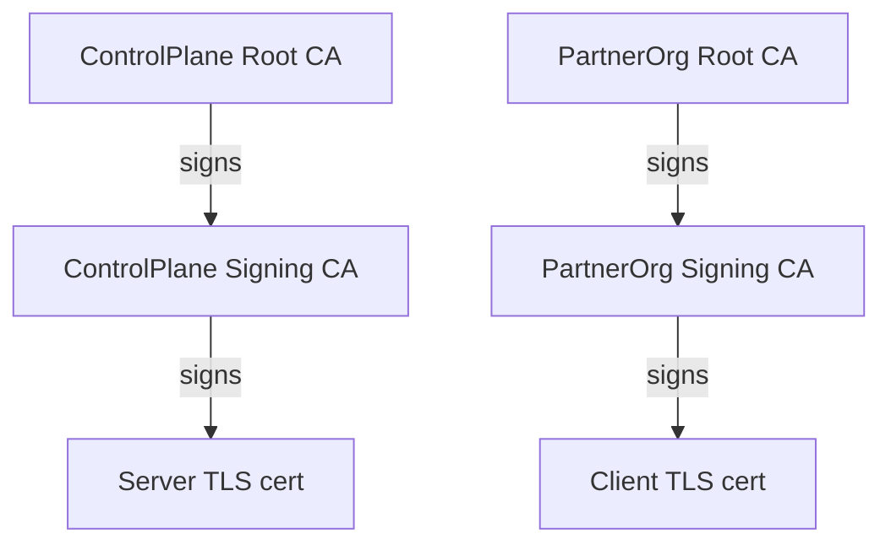

# Mutual TLS Lab

## Introduction

We will now build on the PKI fundamentals in the [Simple local PKI](../lab-2-simple-pki/) lab to demonstrate how trust can be established between two services, allowing an mTLS connection to be set up between a client and a server. This lab will use two separate signing CAs, each sitting under an organization's Root CA.



## Running the Lab

### PKI Setup

As shown in the [Simple local PKI](../lab-2-simple-pki/) lab, we will first create the Root CA, Signing CA keys and certificates for the `ControlPlane` organization, as well as issuing a TLS certificate for a server.

Set up the Root CA:

```bash
mkdir -p ca/root-ca-1/private ca/root-ca-1/db crl certs
chmod 700 ca/root-ca-1/private
touch ca/root-ca-1/db/root-ca-1.db
touch ca/root-ca-1/db/root-ca-1.db.attr
echo 01 > ca/root-ca-1/db/root-ca-1.crt.srl
echo 01 > ca/root-ca-1/db/root-ca-1.crl.srl

openssl req -new \
    -config config/root-ca.conf \
    -out ca/root-ca-1.csr \
    -keyout ca/root-ca-1/private/root-ca-1.key

openssl ca -selfsign \
    -config config/root-ca.conf \
    -in ca/root-ca-1.csr \
    -out ca/root-ca-1.crt \
    -extensions root_ca_ext
```

Set up the Signing CA:

```bash
mkdir -p ca/signing-ca-1/private ca/signing-ca-1/db crl certs
chmod 700 ca/signing-ca-1/private
touch ca/signing-ca-1/db/signing-ca-1.db
touch ca/signing-ca-1/db/signing-ca-1.db.attr
echo 01 > ca/signing-ca-1/db/signing-ca-1.crt.srl
echo 01 > ca/signing-ca-1/db/signing-ca-1.crl.srl

openssl req -new \
    -config config/signing-ca.conf \
    -out ca/signing-ca-1.csr \
    -keyout ca/signing-ca-1/private/signing-ca-1.key

openssl ca \
    -config config/root-ca.conf \
    -in ca/signing-ca-1.csr \
    -out ca/signing-ca-1.crt \
    -extensions signing_ca_ext
```

Issue the TLS certificate:

```bash
SAN=DNS:localhost \
openssl req -new \
    -config config/server.conf \
    -out certs/control-plane.example.csr \
    -keyout certs/control-plane.example.key

openssl ca \
    -config config/signing-ca.conf \
    -in certs/control-plane.example.csr \
    -out certs/control-plane.example.crt \
    -extensions server_ext
```

Bundle the certificates together in a PEM file, so that our client will be able to trust the server:

```bash
cat certs/control-plane.example.crt | openssl x509 > control-plane.example.pem
cat ca/signing-ca-1.crt | openssl x509 > signing-ca-1.pem
cat ca/root-ca-1.crt | openssl x509 > root-ca-1.pem
cat control-plane.example.pem >> cert-chain.pem
cat signing-ca-1.pem >> cert-chain.pem
cat root-ca-1.pem >> cert-chain.pem
rm control-plane.example.pem signing-ca-1.pem root-ca-1.pem
```

Now we will create the certificates in the `PartnerOrg` PKI, and bundle them into a PEM file so that the server will be able to trust the client.

Set up the Partner Root CA:

```bash
mkdir -p ca/root-ca-2/private ca/root-ca-2/db crl certs
chmod 700 ca/root-ca-2/private
touch ca/root-ca-2/db/root-ca-2.db
touch ca/root-ca-2/db/root-ca-2.db.attr
echo 01 > ca/root-ca-2/db/root-ca-2.crt.srl
echo 01 > ca/root-ca-2/db/root-ca-2.crl.srl

openssl req -new \
    -config config/root-ca-2.conf \
    -out ca/root-ca-2.csr \
    -keyout ca/root-ca-2/private/root-ca-2.key

openssl ca -selfsign \
    -config config/root-ca-2.conf \
    -in ca/root-ca-2.csr \
    -out ca/root-ca-2.crt \
    -extensions root_ca_ext
```

Set up the Partner Signing CA:

```bash
mkdir -p ca/signing-ca-2/private ca/signing-ca-2/db
chmod 700 ca/signing-ca-2/private
touch ca/signing-ca-2/db/signing-ca-2.db
touch ca/signing-ca-2/db/signing-ca-2.db.attr
echo 01 > ca/signing-ca-2/db/signing-ca-2.crt.srl
echo 01 > ca/signing-ca-2/db/signing-ca-2.crl.srl

openssl req -new \
    -config config/signing-ca-2.conf \
    -out ca/signing-ca-2.csr \
    -keyout ca/signing-ca-2/private/signing-ca-2.key

openssl ca \
    -config config/root-ca-2.conf \
    -in ca/signing-ca-2.csr \
    -out ca/signing-ca-2.crt \
    -extensions signing_ca_ext
```

Issue the Partner client certificate:

```bash
SAN=DNS:localhost \
openssl req -new \
    -config config/client.conf \
    -out certs/partner-org.example.csr \
    -keyout certs/partner-org.example.key

openssl ca \
    -config config/signing-ca-2.conf \
    -in certs/partner-org.example.csr \
    -out certs/partner-org.example.crt \
    -extensions server_ext
```

Build the client certificate chain:

```bash
cat certs/partner-org.example.crt | openssl x509 > partner-org.example.pem
cat ca/signing-ca-2.crt | openssl x509 > signing-ca-2.pem
cat ca/root-ca-2.crt | openssl x509 > root-ca-2.pem
cat partner-org.example.pem >> cert-chain-2.pem
cat signing-ca-2.pem >> cert-chain-2.pem
cat root-ca-2.pem >> cert-chain-2.pem
rm partner-org.example.pem signing-ca-2.pem root-ca-2.pem
```

Note that `DNS:localhost` has been added to both the server and client certificates so that this example will work locally.

### Run the Server and Client

We have provided a simple golang [Server](./server.go) and [Client](./client.go), which can be run locally to talk to each other over an mTLS connection. Look through the code to see where the keys, certificates and certificate chain PEM files are loaded in.

Run the Server and Client, observing that an mTLS connection is established:

```bash
go run -v server.go
```

Switch to a second terminal tab, making sure you are in this directory, and run:

```bash
go run -v client.go
```

You should see `Zero Trust is awesome!` printed in the second terminal tab, showing that our mTLS connection has been successful.

Now we have seen how mTLS can be used to protect the confidentiality and integrity of data exchanged between two services, whilst confirming the authenticity of the client and server via roots of trust. However, it would be nice if we didn't have to manually create certificates and load them into our services. It would also be nice if we had an easy way to exchange public key material between organizations wanting to establish trust relationships across organizational boundaries (i.e. achieve federation), as we had to do manually in this lab. This is where SPIFFE and SPIRE can help us!

## Teardown

Type `Ctrl + C` in the terminal tab running the server, and run:

```bash
rm -f cert-chain.pem cert-chain-2.pem go.mod hello
rm -rf ca certs crl
```
