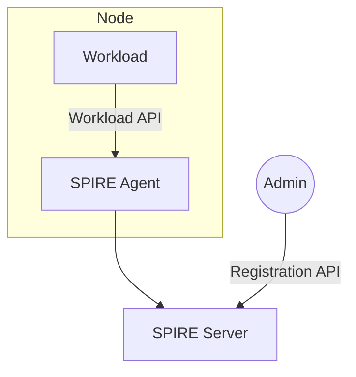
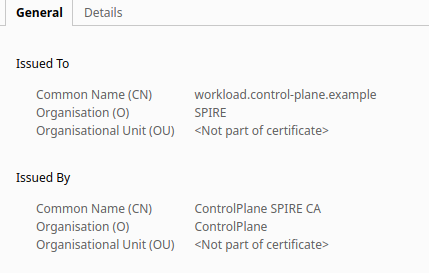

# Simple-Spire Lab

## Introduction

In the previous lab, [MTLS Golang](../lab-3-mtls-golang/README.md), we implemented mTLS between a client and a server
application. We had to generate and distribute the PKI materials (certificates and keys) to both applications and would
have to manage this distribution and rotation securely in a production environment.

In this lab, we will demonstrate how SPIRE can solve the problem of secure distribution and rotation.

SPIRE (the SPIFFE Runtime Environment) is a toolchain of APIs for establishing trust between software systems
across a wide variety of hosting platforms. This allows two workloads to establish trust between each other,
for example by establishing an mTLS connection or by signing and verifying a JWT token. SPIRE can also enable
workloads to securely authenticate to a secret store, a database, or a cloud provider service.

SPIRE exposes the SPIFFE Workload API, which can attest running software systems and issue SPIFFE IDs and
SPIFFE Verifiable Identity Document (SVID) to them. An SVID is the document with which a workload proves
its identity to a resource or caller, it is considered valid if it has been signed by an authority within
the SPIFFE ID’s trust domain. The trust domain corresponds to the trust root of a system. A trust domain
could represent an individual, organization, environment or department running their own independent
SPIFFE infrastructure. All workloads identified in the same trust domain are issued identity documents
that can be verified against the root keys of the trust domain.



For this lab, we can gloss over the details of the SPIRE deployment, and simply focus on the high-level components.

We will deploy a SPIRE Server to a Kubernetes cluster, with SPIRE Agents running on every Node.

We will use the [SPIFFE CSI Driver](https://github.com/spiffe/spiffe-csi) to allow Workloads to access the Workload API
without requiring the permissions to mount hostPath volumes.

We then use the Registration API to create entries for all of the SPIRE Agents running in the cluster and for the
Workload to enable it to retrieve its SVID dynamically and use this for its TLS config, instead of referencing the
files directly.

## Running the Lab

### Initial Setup

There are a number of components that need to run, and collaborate in order to complete this lab. To simplify this, we
will run everything in a Kubernetes cluster. In this example we will use Kind, but you can tailor the instructions to
your own environment if you have another preference.

First we need to launch a Kind cluster. Then we can deploy the following into the cluster:

- SPIRE Server
- SPIFFE CSI Driver
- SPIRE Agent

```shell
kind create cluster --image kindest/node:v1.27.3
kubectl apply -f config/spire-server.yaml
kubectl apply -f config/spire-csi.yaml
kubectl apply -f config/spire-agent.yaml
```

After a short wait, we should see all components are up and running

```shell
kubectl get po -n spire
```

```shell
NAME                      READY   STATUS    RESTARTS   AGE
spiffe-csi-driver-484f2   2/2     Running   0          74s
spire-agent-68jd7         1/1     Running   0          73s
spire-server-0            1/1     Running   0          74s
```

### Implement the Workload

Next we'll create a simple server, that exposes a TLS endpoint, but instead of providing the CA Certificate and the
Server key and certificate, the server will retrieve the PKI materials from the SPIRE Server. The code for the server
can be viewed [here](workload/main.go). Compare this to the code of the [server](../lab-3-mtls-golang/server.go) from
the previous lab.

We first create an X509Source that allows the server to retrieve its X509 SVID and Trust Bundle(s) from SPIRE using
the Workload API. We can use this to create the TLS Config to pass to our server which means when we start the server,
we no longer have to provide the location of the key and certificate `srv.ListenAndServeTLS("", "")`.

Let's build our server image and load it into the Kind cluster.

```shell
docker build -t spire-workload workload
kind load docker-image spire-workload
```

### Create SPIRE Registration Entries

Before we can deploy our server, we need to let SPIRE know what identity to assign when the Workload requests its SVID.
We also need to let SPIRE know which Agents are able to issue the SVID to our Workload. This is done through the Registration
API.

First we need to identify the SPIFFE ID of our SPIRE Agent(s). Run the following command and look for the line
containing **Node attestation was successful**.

```shell
kubectl -n spire logs $(kubectl get po -n spire -l=app=spire-agent -oname) | grep "Node attestation was successful"
```

```shell
...
time="2023-08-11T08:50:30Z" level=info msg="Node attestation was successful" rettestable=true spiffe_id="spiffe://control-plane.example/spire/agent/k8s_psat/example/e771462b-f255-479a-a303-448dc4cc0fd5" subsystem_name=attestor trust_domain_id="spiffe://control-plane.example"
...
```

We can see the Spire Agent has this SPIFFE ID:
**spiffe://control-plane.example/spire/agent/k8s_psat/example/e771462b-f255-479a-a303-448dc4cc0fd5**

If you have multiple Nodes in your cluster, they will each have a different SPIFFE ID. You have two options:

1. create registration entries multiple times for your Workload, one for each of the Nodes the workload could be
   deployed to.
2. create a single registration for every Agent in your cluster, and a single registration for your Workload with the
   new SPIFFE ID assigned to the Agents as it's parent.

We don't care where our workload will run, so we will create a single registration for all of our Agents and one for our
Workload.

```shell
kubectl exec -n spire spire-server-0 -- \
    /opt/spire/bin/spire-server entry create \
    -spiffeID spiffe://control-plane.example/ns/spire/sa/spire-agent \
    -selector k8s_psat:cluster:example \
    -selector k8s_psat:agent_ns:spire \
    -selector k8s_psat:agent_sa:spire-agent \
    -node
```

```shell
Entry ID         : fcb178d6-89a7-49bd-9f7b-ce551f43781b
SPIFFE ID        : spiffe://control-plane.example/ns/spire/sa/spire-agent
Parent ID        : spiffe://control-plane.example/spire/server
Revision         : 0
X509-SVID TTL    : default
JWT-SVID TTL     : default
Selector         : k8s_psat:agent_ns:spire
Selector         : k8s_psat:agent_sa:spire-agent
Selector         : k8s_psat:cluster:example
```

Here we create a registration entry that will apply to all workloads running using the **spire-agent** service account
in the **spire** namespace i.e. our SPIRE Agents. The `-node` flag denotes that the command is used for specifying
node-based selectors and our SPIRE Server is using the Kubernetes Projected Service Account token method of Node
Attestation.

We can check the logs of the Agent again and see that the SVID has been updated.

```shell
kubectl -n spire logs $(kubectl get po -n spire -l=app=spire-agent -oname) | grep "Renewing X509-SVID"
```

```shell
...
time="2023-08-11T08:50:30Z" level=info msg="Renewing X509-SVID" spiffe_id="spiffe://control-plane.example/ns/spire/sa/spire-agent" subsystem_name=manager
...
```

Now, let's create a registration entry for our workload. We will deploy it to the **default** namespace, using the
**workload** service account. We want it to be able to run on any Node in the cluster, so use the previously configured
SPIFFE ID as the parent. Using the `-dns` flag, enables us to set the Common Name in the Certificate minted for our
Workload.

```shell
kubectl exec -n spire spire-server-0 -- \
    /opt/spire/bin/spire-server entry create \
    -spiffeID spiffe://control-plane.example/ns/default/sa/workload \
    -parentID spiffe://control-plane.example/ns/spire/sa/spire-agent \
    -selector k8s:ns:default \
    -selector k8s:sa:workload \
    -dns workload.control-plane.example
```

```shell
Entry ID         : 3214af1a-a41b-4fd7-854a-a33fbefe7e82
SPIFFE ID        : spiffe://control-plane.example/ns/default/sa/workload
Parent ID        : spiffe://control-plane.example/ns/spire/sa/spire-agent
Revision         : 0
X509-SVID TTL    : default
JWT-SVID TTL     : default
Selector         : k8s:ns:default
Selector         : k8s:sa:workload
DNS name         : workload.control-plane.example
```

We can view the registered entries by running the following command.

```shell
kubectl exec -n spire spire-server-0 -- bin/spire-server entry show
```

```shell
Found 2 entries
Entry ID         : 3214af1a-a41b-4fd7-854a-a33fbefe7e82
SPIFFE ID        : spiffe://control-plane.example/ns/default/sa/workload
Parent ID        : spiffe://control-plane.example/ns/spire/sa/spire-agent
Revision         : 0
X509-SVID TTL    : default
JWT-SVID TTL     : default
Selector         : k8s:ns:default
Selector         : k8s:sa:workload

Entry ID         : fcb178d6-89a7-49bd-9f7b-ce551f43781b
SPIFFE ID        : spiffe://control-plane.example/ns/spire/sa/spire-agent
Parent ID        : spiffe://control-plane.example/spire/server
Revision         : 0
X509-SVID TTL    : default
JWT-SVID TTL     : default
Selector         : k8s_psat:agent_ns:spire
Selector         : k8s_psat:agent_sa:spire-agent
Selector         : k8s_psat:cluster:example
```

### Deploy the Workload

We'll now deploy our workload, and port-forward to the Pod so that we can access it through a browser and check the
issued Certificate.

```shell
kubectl apply -f config/spire-workload.yaml
kubectl get po -w
```

When our Workload is running, terminate the waiting process with `Ctrl + C` and then execute the following command.

```shell
kubectl port-forward $(kubectl get po -o name) 8443
```

Now if we open **https://localhost:8443/** in the browser and accept the warnings about the self-signed certificate we
get a response from our server. If we look at the certificate, we can see it has been issued by SPIRE.



## Cleanup

To cleanup, simply terminate the port-forwarding with `Ctrl + C` and delete the Kind cluster.

```shell
kind delete cluster
```

## Conclusion

Congratulations! You have successfully deployed a Workload that retrieves SVIDs from SPIRE and uses these to configure
TLS.
